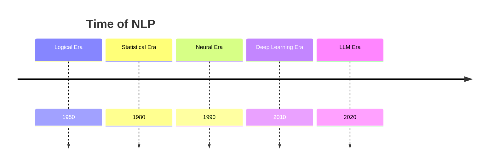

# Week 01: Introduction to NLP

## What is NLP

Techonology to help in language tasks sufficiently (mostly text). For example:
- QA
- MT
- etc.

and it's not just string matching! I understands languages on different linguistic level. Here is an example on text level:

```math
\begin{array} \text{Lexeme} \\ \downarrow \\ \text{Syntax} \\ \downarrow \\ \text{Sematics} \\ \downarrow \\ \text{Discourse} \\ \downarrow \\ \text{Pragmatics} \end{array}
```


## NLP Applications

### Question Answering

NLP can be used in QA task, but sometimes it makes up facts (hallucination).

### Machine Translation

NLP can be use in translation, but sometimes it does not capture all the meaning.

### Search

NLP can be used in search engine, where it can help the engine return more relevant documents. With NLP, search engines can now even know more than just 'what' the user is searching. It can now know 'why' the user is seaching!


### Information Extraction

NLP overlaps with Data Science on information extraction from textual data.


sometimes fail at basic tasks


### Trends Analytics


## History of NLP

**Different eras of NLP**



**Evolution of NLP**

```math
\text{Bag of words} \rightarrow \text{Word Embeddings} \rightarrow \text{RNN} \rightarrow \text{LSTM} \rightarrow \text{Bi-LSTM} \rightarrow \text{Attention} \rightarrow \text{Transformers}
```

### Logical Era: Symbolic Approach, Knowledge-based Approach

Representing language knowledge as a set of rules made by human experts.

**Disadvantage**: Require immense effort.

### Statistical Era: Statistical Approacj


